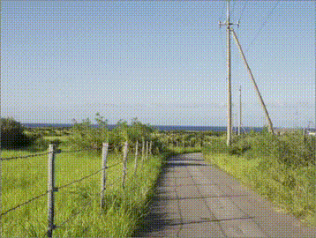
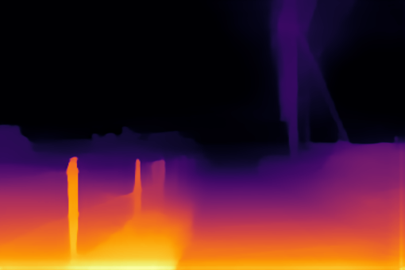

# Pseudo Stereo Picture Generation Demo
This program generates a set of pseudo stereo pictures from an input image using the [Intel(r) Distribution of OpenVINO(tm) toolkit](https://software.intel.com/en-us/openvino-toolkit).  
The demo program uses a DL model, `midasnet` to generate a depth map from a picture, shift the pixcels horizontally according to the depth of the pixels, then compensate the lacking pixcels caused by the shifted pixels with an image inpainting DL model `gmcnn`.  

このデモプログラムは[Intel(r) Distribution of OpenVINO(tm) toolkit](https://software.intel.com/en-us/openvino-toolkit)を使用し、１枚の絵から疑似ステレオ画像を作成するものです。  
プログラムは入力画像から`midasnet` DLモデルを使用して深度マップを作成し、ピクセル深度に従って各ピクセルを横方向にシフトし、ピクセルシフトによりできた欠損部分を`gmcnn`画像修復DLモデルで補うことで、疑似ステレオ画像（っぽい）画像を生成しています。


### Generated Pseudo Stereo Images


### Depth Image Generated From the Input Picture (This demo won't display this image)


### Required DL Models to Run This Demo

The demo expects the following models in the Intermediate Representation (IR) format:

  * `midasnet`
  * `gmcnn-places2-tf`

You can download this model from OpenVINO [Open Model Zoo](https://github.com/opencv/open_model_zoo).
In the `models.lst` is the list of appropriate models for this demo that can be obtained via `Model downloader`.
Please see more information about `Model downloader` [here](../../../tools/downloader/README.md).

## How to Run


### 0. Prerequisites
- **OpenVINO 2020.2**
  - If you haven't installed it, go to the OpenVINO web page and follow the [*Get Started*](https://software.intel.com/en-us/openvino-toolkit/documentation/get-started) guide to do it.  


### 1. Install dependencies  
The demo depends on:
- `opencv-python`
- `numpy`

To install all the required Python modules you can use:

``` sh
(Linux) pip3 install -r requirements.txt
(Win10) pip install -r requirements.txt
```

### 2. Download DL models from OMZ
Use `Model Downloader` to download the required models and convert the downloaded model into OpenVINO IR models with `Model Converter`.  
The source model of the `midasnet` is in PyTorch format. Please make sure you have installed prerequisites for `pytorch_to_onnx.py` converter tool.  

``` sh
(Linux) 
  # Install prerequisites for pytorch_to_onnx.py. This is required only for the 1st time
  python3 -m pip install -r $INTEL_OPENVINO_DIR/deployment_tools/tools/model_downloader/requirements-pytorch.in
  python3 $INTEL_OPENVINO_DIR/deployment_tools/tools/model_downloader/downloader.py --list models.lst
  python3 $INTEL_OPENVINO_DIR/deployment_tools/tools/model_downloader/converter.py --list models.lst
       
(Win10) 
  # Install prerequisites for pytorch_to_onnx.py. This is required only for the 1st time
  python3 -m pip install -r "%INTEL_OPENVINO_DIR%\deployment_tools\tools\model_downloader\requirements-pytorch.in"
  python "%INTEL_OPENVINO_DIR%\deployment_tools\tools\model_downloader\downloader.py" --list models.lst
  python "%INTEL_OPENVINO_DIR%\deployment_tools\tools\model_downloader\converter.py" --list models.lst
```

### 3. Run the demo app

``` sh
(Linux) python3 pseudo-stereo-picture.py <input_image_file>
(Win10) python pseudo-stereo-picture.py <input_image_file>
```

## Demo Output  
The application draws the results on the screen.

## Tested Environment  
- Windows 10 x64 1909 and Ubuntu 18.04 LTS  
- Intel(r) Distribution of OpenVINO(tm) toolkit 2020.2  
- Python 3.6.5 x64  

## See Also  
* [Using Open Model Zoo demos](../../README.md)  
* [Model Optimizer](https://docs.openvinotoolkit.org/latest/_docs_MO_DG_Deep_Learning_Model_Optimizer_DevGuide.html)  
* [Model Downloader](../../../tools/downloader/README.md)  
